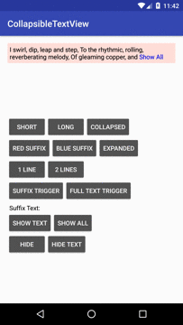

CollapsedTextView
===================

Only 70 addtional methods added using this library.

Integration
=============

- Using gradle. Add the dependency in your app.gradle

```
dependencies {
  compile 'com.timqi.collapsibletextview:library:1.1.2'
}
```

- Or you can Clone the repo from github. If you are using Android Studio. Select File -> New -> Import Module and navigate the source directory to the library folder is OK!

Demo
========



You can download the [demo apk](art/example-debug.apk) directly or compile manually using:

```
./gradlew assembleDebug
```

How to Use
============

To set the full text of CollapsibleTextView

```java
CollapsibleTextView mCollapsibleTextView = (CollapsibleTextView) findViewById(R.id.normal);

mCollapsibleTextView.setFullString(mLongText);
```

Set expanded or collapsed

```java
mCollapsibleTextView.setExpanded(true);

//mCollapsibleTextView.setExpanded(false);
```

- See the example code in project is the simplest way to konw how to use WindRoseDiagramView. And here to provide a number of parameters to explain.

```xml
<com.timqi.collapsibletextview.CollapsibleTextView
  xmlns:app="http://schemas.android.com/apk/res-auto"
  android:id="@+id/normal"
  android:layout_width="wrap_content"
  android:layout_height="wrap_content"
  android:padding="5dp"

  app:collapsedLines="2"
  app:collapsedText=" Show All"
  app:expandedText=" Hide"
  app:suffixColor="#0000ff"
  app:suffixTrigger="true" // whether it is triggered by suffix only
  />
```

- You can custom view using java code

```java
// value is a proper value

mCollapsibleTextView.setCollapsedLines(1);
mCollapsibleTextView.setCollapsedText(" Show Text");
mCollapsibleTextView.setExpandedText(" Hide Text");
mCollapsibleTextView.setSuffixColor(0xff0000ff);
mCollapsibleTextView.setSuffixTrigger(true);
```

Author
========

- [mail](mailto://i@timqi.com)
- [weibo](http://weibo.com/timqi)
- [twitter](https://twitter.com/timqi_cn)

Join and [pull request](https://github.com/timqi/WindRoseDiagramView/compare) for whatever you want.

License
=======

    Copyright 2017 Tim Qi

    Licensed under the Apache License, Version 2.0 (the "License");
    you may not use this file except in compliance with the License.
    You may obtain a copy of the License at

       http://www.apache.org/licenses/LICENSE-2.0

    Unless required by applicable law or agreed to in writing, software
    distributed under the License is distributed on an "AS IS" BASIS,
    WITHOUT WARRANTIES OR CONDITIONS OF ANY KIND, either express or implied.
    See the License for the specific language governing permissions and
    limitations under the License.
